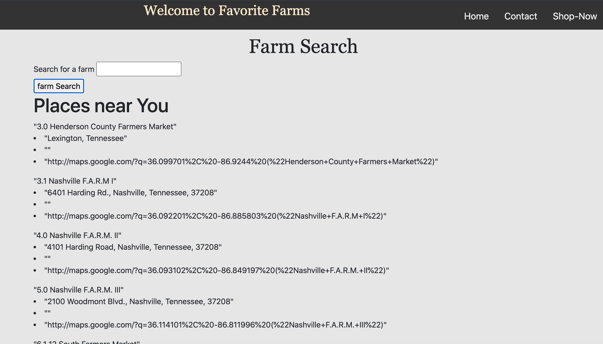

# projectX

Originally named projectX, Favorite Farms is a useful application that is responsive to mobile devices. On the homepage, the user's location is used to pull up 10 nearby farms from an API.  The Shop-Now page uses a search bar to pull up food items from an API and give nutritional information.  There is also a contact page to leave your information as either a potential seller or buyer.

Published Site: grigore94.github.io/projectX

